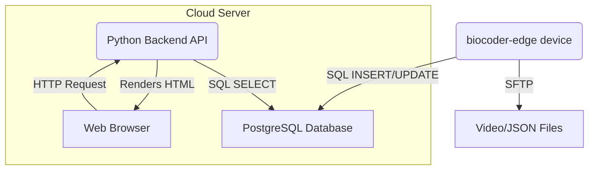

# BioCoder-Cloud

[](https://opensource.org/licenses/MIT)
[](https://www.python.org/downloads/)
[](https://fastapi.tiangolo.com/)

This repository contains the cloud-side backend for the **BioCoder** project. It provides the necessary infrastructure to receive, store, and query data from remote `biocoder-edge` devices deployed in the field.

The core components are:

- A **PostgreSQL Database** for storing structured event metadata.
- A **Python Backend API** (built with FastAPI) for handling data ingestion and search queries.
- A **Simple Web Interface** for biologists to search and visualize the collected event data.

This application is designed to be deployed using Docker for a consistent and reproducible environment.

## System Architecture

The `biocoder-cloud` application works in tandem with the `biocoder-edge` devices. The edge devices are responsible for uploading video and JSON files to the server and inserting initial records into the database. This cloud application provides the interface for accessing that data.



## Features

- **Database Schema:** A robust PostgreSQL schema for storing detailed event metadata.
- **RESTful API:** A clean API endpoint for searching events based on multiple criteria.
- **Web-Based Search:** An intuitive user interface allowing researchers to filter events by:
  - Animal species (with AND/OR logic)
  - Date range
  - Time of day (Day/Night)
  - Device ID
  - Detection confidence
- **Dockerized Deployment:** Uses Docker and Docker Compose for easy setup and deployment.

## Getting Started

Follow these instructions to get the cloud application running locally for development.

### Prerequisites

- [Docker](https://www.docker.com/get-started) and [Docker Compose](https://docs.docker.com/compose/install/)
- A `.env` file for storing secrets (see configuration section)

### Installation & Setup

1. **Clone the repository:**
   
   ```sh
   git clone https://github.com/your-username/biocoder-cloud.git
   cd biocoder-cloud
   ```

2. **Create the Database Schema:**
   Before running the application, you'll need the initial SQL to create the database tables. This is defined in `db/schema.sql`. The Docker setup will run this automatically on the first launch.

3. **Configure Environment Variables:**
   The application uses a `.env` file to manage sensitive information like database credentials. Create a file named `.env` in the root of the repository.
   
   **`.env` file example:**
   
   ```env
   # PostgreSQL Credentials
   POSTGRES_DB=biocoder_db
   POSTGRES_USER=db_user
   POSTGRES_PASSWORD=a_very_strong_password
   
   # Application Port
   APP_PORT=8000
   ```
   
   *Note: The `POSTGRES_*` variables are used by both the official PostgreSQL Docker image and our Python application to ensure they are synchronized.*

### Running the Application

With Docker and Docker Compose installed, running the entire stack (web application and database) is as simple as:

```sh
docker-compose up --build
```

- `--build`: This flag tells Docker Compose to rebuild the images if the code has changed.

Once the containers are running, you can access the web interface in your browser at:
**`http://localhost:8000`** (or whichever port you specified in your `.env` file).

To stop the application, press `Ctrl+C` in the terminal where `docker-compose` is running, and then run:

```sh
docker-compose down
```

## Project Structure

- **`docker-compose.yml`**: Defines the services, networks, and volumes for the application stack (Python app + PostgreSQL DB).
- **`app/`**: Contains all the Python source code for the FastAPI web application.
  - `main.py`: The main entry point that starts the FastAPI server.
  - `api.py`: Defines the API routes (e.g., `/search`).
  - `crud.py`: Contains the database query functions (Create, Read, Update, Delete).
  - `models.py`: Defines the Pydantic data models for validation.
  - `config.py`: Handles loading settings from environment variables.
  - `static/` & `templates/`: Holds the CSS and HTML files for the frontend.
- **`db/`**: Contains database-related files.
  - `schema.sql`: The initial table creation script.
  - `migrations/`: A directory for future database schema migrations (using a tool like Alembic).

## API Endpoints

The primary endpoint for the web interface is:

- **`GET /`**: Renders the main search page (`search.html`).
- **`POST /search`**: Receives the search form data, queries the database, and renders the results.

## Contributing

Contributions are welcome! Please feel free to submit a pull request or open an issue for bugs, feature requests, or improvements.

## License

This project is licensed under the MIT License - see the [LICENSE](LICENSE) file for details.
